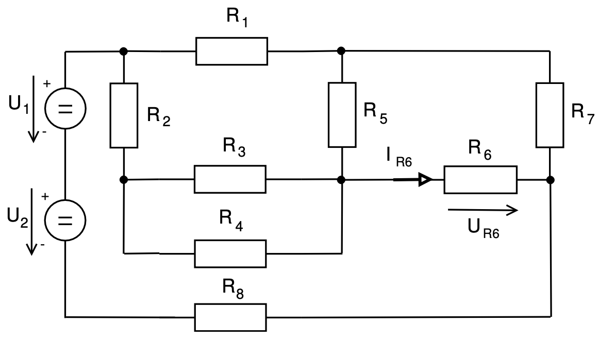
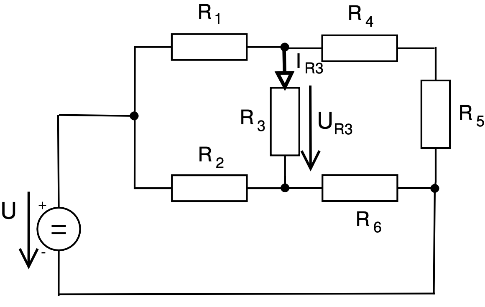
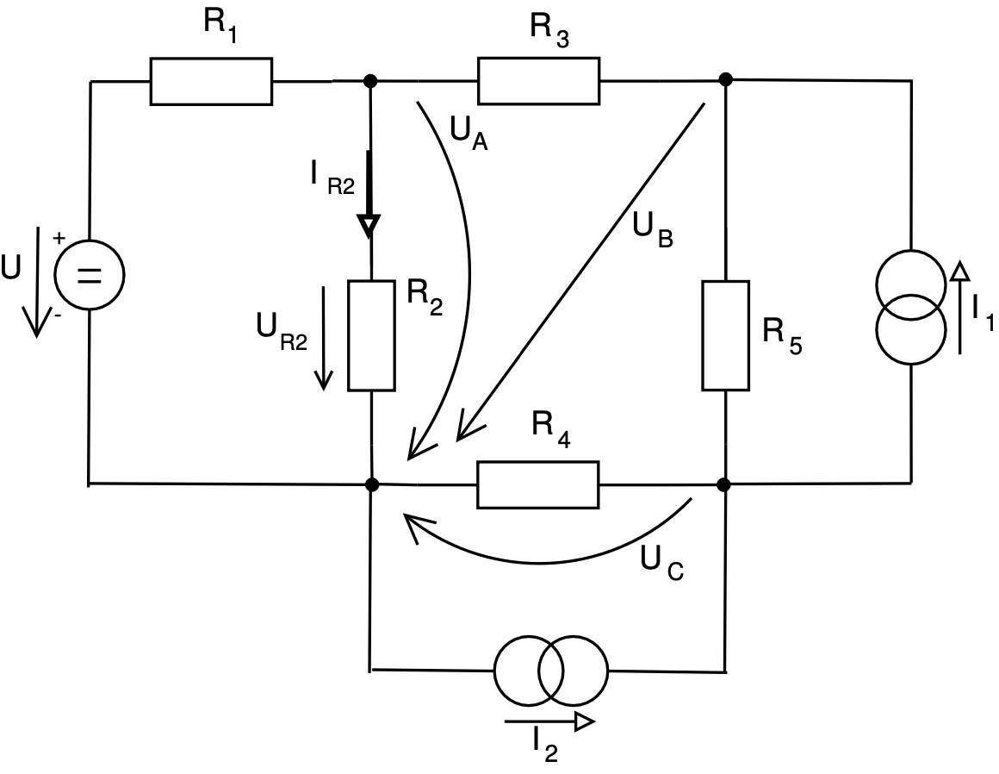
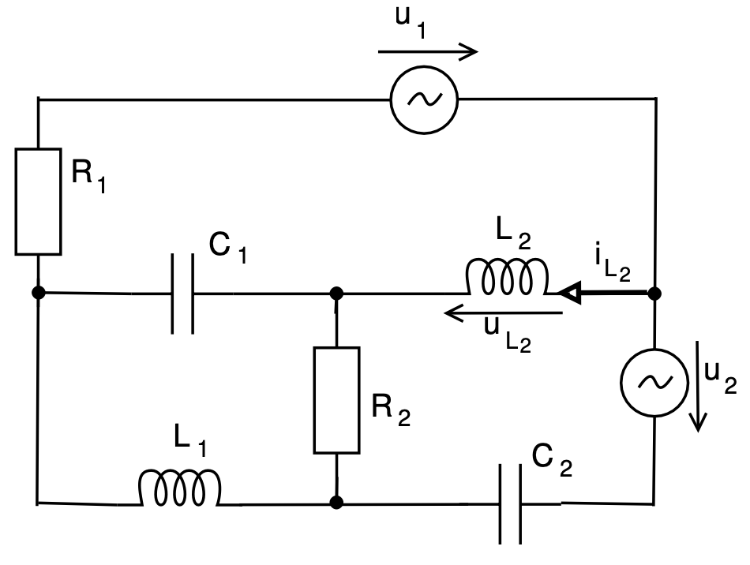
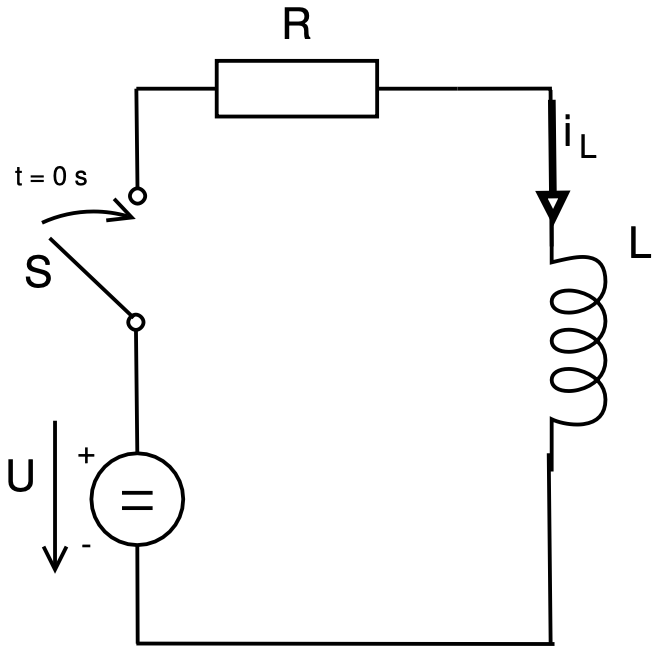

# IEL project
Simple circuits related tasks (see [assignment](assignment.pdf) - Czech only)
1. Calculate voltage `U_R6` and current `I_R6` through resistor. - **2 of 2 points**.

2. Calculate voltage `U_R3` and current `I_R3`, using [Thevenin's theorem](https://en.wikipedia.org/wiki/Th%C3%A9venin%27s_theorem) - **1 of 1 point**.

3. Calculate voltage `U_R2` and current `I_R2` using 1. Kirchoff's law - **2 of 2 points**.

4. Calculate voltage `|U_L2|` and `α_L2` using 2. Kirchoff's law - **0 of 2 points** (skipped).

5. Formule differential equation that describes circuit bellow - **0 of 2 points** (skipped).

If you are interested, see my [solution](xdobro23.pdf) (unfortunately, in Slovak only).
