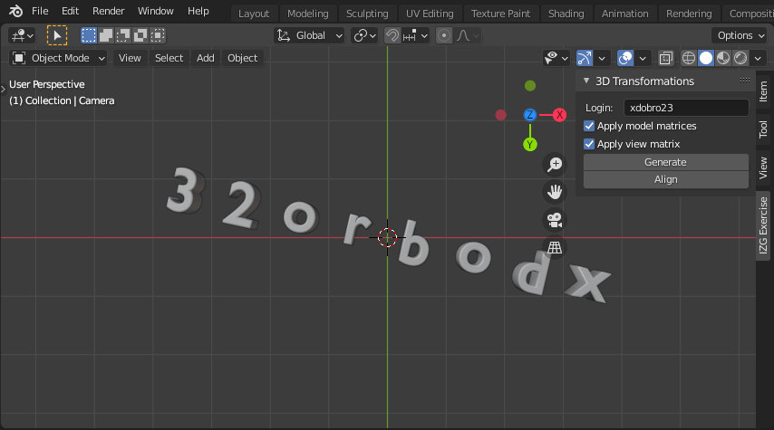

# 3D transformations
The goal of this laboratory is to create Blender script written in Python to generate models of your school login in Blender scene.
My version of the assignment: `Your name should be written backward and a little bit rotated` 

## Tasks
- in `createView()` method
    - set correct values for camera matrix
    - set correct values for center matrix
    - set correct values for X, Y and Z direction matrix
- implement transformation of objects _(characters of your school login)_ in function `createTransformation()`
- apply matrix of transformation in `applyTransformation()` method

## Script control
- Load script to Blender (version >= 2.8)
- To array `Login` enter your school login
- Press `Generate` button to generate characters of your login
- Press `Align` to set the viewport

## Example
My school login is `xdobro23`.

## Rating
3/3 points
